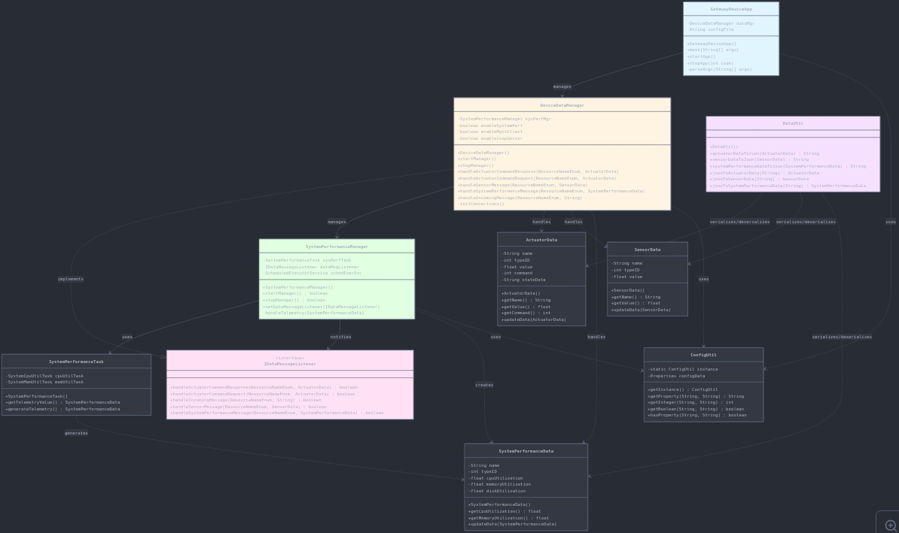

Lab Module 05

Description

What does your implementation do?

This implementation completes the data integration layer for the Gateway Device Application (GDA). It introduces JSON serialization and deserialization capabilities through the DataUtil class, enabling conversion between Java data objects (ActuatorData, SensorData, and SystemPerformanceData) and JSON format. The implementation also restructures the application architecture by introducing DeviceDataManager as a central management component that coordinates system performance monitoring and implements the IDataMessageListener interface to handle incoming telemetry data.

How does your implementation work?

The GatewayDeviceApp serves as the entry point, initializing and managing the lifecycle of DeviceDataManager, which in turn manages the SystemPerformanceManager. The SystemPerformanceManager periodically collects CPU and memory utilization metrics using scheduled tasks and notifies DeviceDataManager through the IDataMessageListener callback interface. DeviceDataManager processes these callbacks by handling the SystemPerformanceData objects and logging the telemetry information. The DataUtil class provides static methods for bidirectional JSON conversion using the Gson library. Configuration management is handled through ConfigUtil, which reads properties from PiotConfig.props to enable or disable system components.

Code Repository and Branch

URL: https://github.com/empress-t-png/gda-java-components/tree/labmodule05

UML Design Diagram(s)

Key Components:
- **GatewayDeviceApp**: Entry point managing application lifecycle
- **DeviceDataManager**: Central manager implementing IDataMessageListener
- **SystemPerformanceManager**: Collects and reports system telemetry
- **DataUtil**: Provides JSON serialization/deserialization
- **Data Classes**: ActuatorData, SensorData, SystemPerformanceData

 Unit Tests Executed
- ConfigUtilTest
- SystemCpuUtilTaskTest
- SystemMemUtilTaskTest
- ActuatorDataTest
- SensorDataTest
- SystemPerformanceDataTest
- SystemStateDataTest
- DataUtilTest

 Integration Tests Executed
- SystemPerformanceManagerTest
- DataIntegrationTest
- DeviceDataManagerNoCommsTest
- GatewayDeviceAppTest
