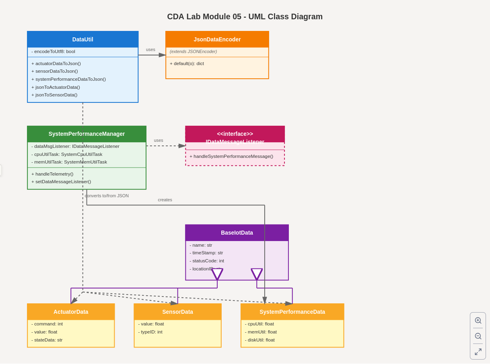

Constrained Device Application (Connected Devices)

Lab Module 05 cda

Description

What does your implementation do?

This implementation adds JSON serialization capabilities to the CDA through the DataUtil class, which converts ActuatorData, SensorData, and SystemPerformanceData objects to JSON format and back. The SystemPerformanceManager was enhanced to create SystemPerformanceData containers for CPU and memory metrics and notify listeners via the IDataMessageListener callback interface. This enables the CDA to exchange data with the GDA in a standardized JSON format.
How does your implementation work?

The DataUtil class uses Python's json library with a custom JsonDataEncoder to serialize objects by converting them to dictionaries via __dict__. For deserialization, it parses JSON strings and maps key-value pairs to object attributes using setattr(). The SystemPerformanceManager collects CPU and memory utilization every 5 seconds using APScheduler, packages the data into SystemPerformanceData instances, and triggers callbacks to registered listeners through handleSystemPerformanceMessage().

Code Repository and Branch

URL: https://github.com/empress-t-png/cda-python-components/tree/labmodule05

UML Design Diagram(s)

Diagram Overview:
- DataUtil: Provides JSON conversion methods for data objects
- JsonDataEncoder: Handles Python object serialization
- SystemPerformanceManager: Creates data containers and manages listener callbacks
- Data Classes: ActuatorData, SensorData, SystemPerformanceData extending BaseIotData

Unit Tests Executed

- DataUtilTest
  - testActuatorDataConversionsFromJson
  - testActuatorDataConversionsFromObject
  - testSensorDataConversionsFromJson
  - testSensorDataConversionsFromObject
  - testSystemPerformanceConversionsFromJson
  - testSystemPerformanceDataConversionsFromObject

Integration Tests Executed

- SystemPerformanceManagerTest
  - testStartAndStopManager
